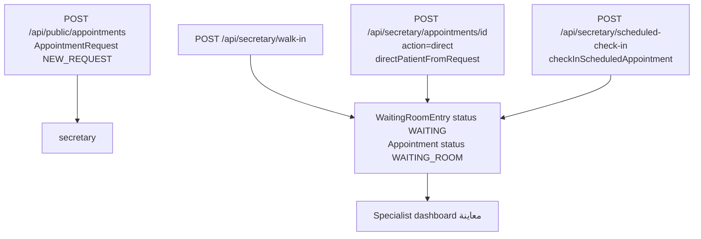

# Legacy Daily Work and Queue Flow

## What «يوم العمل» is

**Found:** UI navigation group label only (`navDoctorSpecialistAr` → `/doctor/specialist/workday`).  

**Not found:**

- No `page.tsx` for `/doctor/specialist/workday`
- No `DailyWork` / clinic-day-open/close model
- No manual day open/close actions

**Runtime meaning:** «يوم العمل» groups two live pages:

1. **المعاينة** — current waiting / in-session patients for this doctor  
2. **لوحة اليوم** — all of today’s appointments for this doctor, sectioned by status  

The “day” is **derived from Algeria calendar bounds** (`algiersDayBounds` in `src/lib/daily-queue.ts`) + appointment/`WaitingRoomEntry` rows — **automatically**, not manually opened.

## Queue admission (before doctor sees patient)

Core service: `src/lib/services/appointments.ts`  

- `directPatientFromRequest` (~L500+)  
- `checkInScheduledAppointment` (~L692+)  

## Exam state transitions (verified)

### WaitingRoomStatus (schema enum)

`ARRIVED` → `WAITING` → `WITH_DOCTOR` → `SESSION_DONE` | `NEEDS_FOLLOWUP` | `LEFT`

**Doctor exam API uses:** `WAITING` → `WITH_DOCTOR` → `SESSION_DONE` (`api/doctor/exam/route.ts`).

### AppointmentStatus linked by exam

| Event | Appointment status |
| --- | --- |
| Direct / check-in to WR | `WAITING_ROOM` |
| Exam start | `IN_TREATMENT` |
| Exam complete | `FOLLOW_UP_REQUIRED` (+ optional Invoice) |

### Parallel secretary path (defect risk)

`POST /api/secretary/waiting-room/[id]` can change WR status **without** always mirroring Appointment the same way as exam route — **authorization does not always enforce `entry.doctorId` ownership** for doctors (unlike exam).

## المعاينة vs لوحة اليوم

| | المعاينة | لوحة اليوم |
| --- | --- | --- |
| File | `specialist/dashboard/page.tsx` | `specialist/today/page.tsx` |
| Primary query | `waitingRoomEntry` WAITING\|WITH_DOCTOR | `appointment` today + WR include |
| Purpose | Act on live queue / start exam | Overview board (upcoming/waiting/withDoctor/done) |
| Actions | `DoctorExamPanel` معاينة | `DoctorTodayBoard` navigation / display |
| Shared components | Shell + nav only | `ClinicWorkflowGuide` + board |

## Does the doctor “open” daily work?

**No.** Opening `/doctor/specialist/dashboard` reads current DB queue. Closing the clinic day is **not** modeled.

## Post-exam finance handoff

Complete exam may create `Invoice` (status `ISSUED`, unpaid). Secretary collects via:

- `/api/secretary/collect-charge`
- `/api/secretary/payments`
- `/api/secretary/checkout`

## Real-time

Redis `publishEvent("clinic:waiting-room", …)` on exam mutate. Specialist dashboard **does not subscribe**; only SSE `/api/realtime/stream` exists for authenticated users (polling DB counts every 5s server-side) — **not consumed by specialist معاينة UI**.
